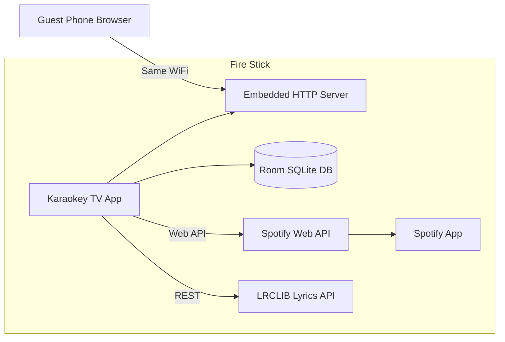

# Karaokey — Fire Stick Spotify Karaoke Design Spec

**Date:** 2026-09-03  
**Status:** Approved for implementation planning  
**Scope:** v1 personal sideload (single household, single Premium account)

---

## Summary

Karaokey is a sideloaded Android TV app for Amazon Fire Stick that turns any Spotify track into a living-room karaoke experience. The host logs in with Spotify Premium once. Guests on the same Wi-Fi scan a QR code and add songs from their phone browsers — no Spotify account required. The TV displays large synced lyrics while audio plays through the Spotify app on the Fire Stick.

**Explicitly out of scope for v1:**
- Vocal removal / EQ filtering (blocked by Spotify DRM; not technically feasible on Fire Stick with third-party apps)
- Official Spotify Jam integration (no public API)
- Cloud backend, Play Store distribution, multi-household auth
- Guest Spotify logins

---

## Problem Statement

Karaoke libraries are limited. At parties, people want obscure or niche songs that are not available as official karaoke tracks. Installing Spotify alone does not provide a karaoke UI, guest enqueue, or large-format synced lyrics on TV.

---

## Goals

| Goal | Success measure |
|------|-----------------|
| Any song in Spotify catalog | Guest can search and enqueue any track |
| Easy party enqueue | Guest adds song in < 30 seconds via phone browser |
| TV karaoke experience | Lyrics visible from couch; current line highlighted |
| Single-app party flow | Host uses Karaokey only; guests never open Spotify |
| Personal sideload | Works on developer's Fire Stick via APK install |

---

## Non-Goals (v1)

- Vocal isolation or instrumental filtering
- Spotify Jam / party queue API (unavailable to third parties)
- Play Store release or OAuth for strangers
- Offline playback
- Multi-room / Chromecast
- User accounts beyond host Spotify login

---

## Architecture

### Recommended approach: Spotify Connect controller

Karaokey owns the party queue and lyrics UI. The Spotify app on the Fire Stick handles audio playback. Karaokey pushes tracks via the Spotify Web API.



### Components

| Component | Technology | Responsibility |
|-----------|------------|----------------|
| TV app | Kotlin, Jetpack Compose for TV | Lyrics screen, QR display, host controls, playback orchestration |
| Embedded server | Ktor (Netty) | Serve guest web UI; REST + WebSocket for queue updates |
| Queue store | Room (SQLite) | Party queue, track metadata cache, guest attribution |
| Spotify client | Ktor Client / Retrofit | OAuth, search, playback control, currently-playing polling |
| Lyrics client | Ktor Client | Fetch synced/plain lyrics from LRCLIB |
| Guest web UI | Static HTML + vanilla JS | Search, enqueue, view up-next (served by Ktor) |

### Alternatives considered

| Approach | Verdict |
|----------|---------|
| Embedded Web Playback SDK in WebView | Rejected for v1 — fragile on Fire TV WebView; harder to debug |
| Spotify Jam as queue | Rejected — no public API to create/join/manage Jams |
| Phone-only controller | Rejected — still need TV app for lyrics; worse host UX |
| Cloud-hosted guest UI | Rejected — unnecessary for personal sideload; adds HTTPS/domain complexity |

---

## User Flows

### First-time setup

1. Host sideloads Karaokey APK on Fire Stick.
2. Host opens Karaokey → prompted to connect Spotify.
3. OAuth via **device authorization flow** (display code + URL on TV; host completes on phone) or **PKCE with phone redirect**.
4. Host grants scopes; tokens stored in EncryptedSharedPreferences.
5. Karaokey detects Fire Stick as Spotify Connect device; prompts host to open Spotify app once if needed.
6. Setup complete → party screen with QR code.

### Party session

1. TV shows QR code linking to `http://<stick-ip>:8080`.
2. Guest scans QR, opens guest page on same Wi-Fi.
3. Guest searches song, taps **Add to queue**, optionally enters display name.
4. Song appears in shared queue on TV and all connected guest browsers (WebSocket).
5. When song reaches front of queue, Karaokey:
   - Fetches lyrics (LRCLIB by track name + artist, with ISRC if available)
   - Calls Spotify Web API to play track on Fire Stick device
   - Displays synced lyrics on TV
6. On track end or host skip, advance to next queued song.

### Host controls (Fire Stick remote)

- Skip to next song
- Pause / resume
- Remove song from queue
- Show/hide QR overlay
- Lock queue (optional v1.1 — reject guest adds when locked)

---

## Spotify Integration

### Requirements

- **Spotify Premium** (host account)
- **Spotify app installed** on Fire Stick
- Spotify Developer app in Dashboard (Development Mode, ≤25 users — sufficient for personal use)

### OAuth

- Flow: Authorization Code with PKCE
- First-launch UX: Device Authorization Grant preferred for TV (no redirect URI on TV)
- Token storage: EncryptedSharedPreferences
- Refresh: Automatic before API calls; force re-login on refresh failure

### Scopes

```
user-read-playback-state
user-modify-playback-state
user-read-currently-playing
user-read-private
```

Note: `streaming` scope reserved for future Web Playback SDK path; not required for Connect controller approach.

### API usage

| Action | Endpoint |
|--------|----------|
| Search tracks | `GET /v1/search?type=track&q={query}` |
| Start playback | `PUT /v1/me/player/play?device_id={id}` with `{ "uris": ["spotify:track:..."] }` |
| Add to Spotify queue | `POST /v1/me/player/queue?uri=...` (optional preload of next track) |
| Get devices | `GET /v1/me/player/devices` |
| Transfer playback | `PUT /v1/me/player` with `{ "device_ids": ["..."], "play": true }` |
| Currently playing | `GET /v1/me/player/currently-playing` |
| Skip | `POST /v1/me/player/next` |
| Pause / resume | `PUT /v1/me/player/pause`, `PUT /v1/me/player/play` |

### Queue ownership model

Karaokey maintains its **own party queue** in SQLite. Spotify's native queue is a transport layer only:

1. Karaokey pops next track from local queue.
2. Karaokey calls `play` with that track URI on the Fire Stick device.
3. Optionally preloads the following track via `POST /queue` for gapless handoff.
4. Polls `currently-playing` every **1 second** during playback for lyrics sync and end-of-track detection.

This avoids relying on Spotify's queue state, which guests could modify if they had Spotify access.

---

## Lyrics Integration

### Provider: LRCLIB

- Base URL: `https://lrclib.net/api`
- Search by `track_name` + `artist_name`
- Prefer synced lyrics (LRC format) when `syncedLyrics` field present
- Fallback: plain `plainLyrics` displayed statically (no line highlight)
- Cache lyrics in SQLite keyed by Spotify track ID to reduce API calls

### Sync algorithm

1. Parse LRC timestamps into `(timeMs, lineText)` pairs.
2. On each poll, read `progress_ms` from currently-playing response.
3. Highlight line where `lineTime <= progress_ms < nextLineTime`.
4. Show ±1 surrounding lines dimmed for context.

### Missing lyrics

Display banner: "Lyrics unavailable — enjoy the music!" with song title and artist. Playback continues normally.

---

## Guest Web UI

### Pages

| Route | Purpose |
|-------|---------|
| `GET /` | Search + add form + up-next list |
| `GET /api/search?q=` | Proxy search to Spotify (uses host token server-side) |
| `POST /api/queue` | Add track `{ spotifyUri, trackName, artistName, addedBy? }` |
| `GET /api/queue` | Current queue JSON |
| `DELETE /api/queue/:id` | Remove item (host-only or item added by same session — v1: host TV only for delete) |
| `WS /ws` | Real-time queue + now-playing updates |

### UX requirements

- Mobile-first responsive layout
- Debounced search (300ms)
- Toast confirmation on add
- No login required for guests
- Show "Can't reach Karaokey" if server unreachable

### Security (local network)

- Bind server to `0.0.0.0:8080` on local Wi-Fi only
- No auth for guests in v1 (trusted home network)
- Rate limit search: 10 req/min per IP
- Validate track URIs match `spotify:track:` pattern

---

## TV UI (Compose for TV)

### Screens

1. **Login** — Spotify connect button, device code display
2. **Party** — Main karaoke view (lyrics + queue sidebar + QR)
3. **Settings** — Re-login, show IP, app version

### Party screen layout

```
┌─────────────────────────────────────────────────────────┐
│  [QR mini]     Song Title — Artist          [Queue: 4]  │
├─────────────────────────────────────────────────────────┤
│                                                         │
│              previous line (dim)                        │
│           ▶ CURRENT LINE (large, bold) ◀                │
│              next line (dim)                            │
│                                                         │
├─────────────────────────────────────────────────────────┤
│  ████████████░░░░░░░░  2:14 / 3:45                       │
│  Added by: Marco                    [Skip] [Pause]      │
└─────────────────────────────────────────────────────────┘
```

### D-pad navigation

- **Skip** / **Pause**: default focus actions
- **Menu**: toggle queue panel
- **Back**: confirm exit party (queue persists until app killed)

---

## Data Model

### `queue_items`

| Column | Type | Notes |
|--------|------|-------|
| id | INTEGER PK | Auto |
| spotify_uri | TEXT | `spotify:track:...` |
| track_name | TEXT | |
| artist_name | TEXT | |
| album_art_url | TEXT | Nullable |
| duration_ms | INTEGER | |
| added_by | TEXT | Guest display name or "Host" |
| position | INTEGER | Sort order |
| status | TEXT | `pending`, `playing`, `played`, `skipped` |
| created_at | INTEGER | Epoch ms |

### `lyrics_cache`

| Column | Type | Notes |
|--------|------|-------|
| spotify_uri | TEXT PK | |
| lrc_text | TEXT | Raw LRC |
| fetched_at | INTEGER | |

### `settings`

| Key | Value |
|-----|-------|
| spotify_access_token | Encrypted |
| spotify_refresh_token | Encrypted |
| spotify_token_expiry | Long |
| spotify_device_id | String |
| party_session_id | UUID |

---

## Fire Stick Deployment

### Build targets

- `minSdk`: 25 (Fire OS 7+)
- `targetSdk`: 34
- ABI: `armeabi-v7a`, `arm64-v8a` (Fire Stick 4K Max uses arm64)

### Sideload steps

1. Enable ADB debugging on Fire Stick (Developer Options).
2. Build release APK: `./gradlew assembleRelease`
3. Install: `adb connect <stick-ip>:5555 && adb install app-release.apk`
4. Launch from Apps & Games → Karaokey

### Runtime dependencies

- Fire Stick and guest phones on **same Wi-Fi subnet**
- Spotify app installed and logged into **same Premium account** (or Karaokey login suffices; Spotify app used as Connect target)
- Display stick IP on TV if QR fails (Settings screen)

---

## Error Handling

| Condition | Behavior |
|-----------|----------|
| No Wi-Fi | Full-screen "Connect to Wi-Fi" |
| Token expired | Silent refresh; login screen if refresh fails |
| Spotify app not running | Prompt: "Open Spotify once, then return to Karaokey" |
| No active device | Auto-select Fire Stick device from `/devices` |
| LRCLIB timeout / 404 | Plain fallback; no crash |
| Guest on wrong network | Guest page shows troubleshooting with stick IP |
| Empty queue | Idle screen with QR and "Add your first song!" |
| API rate limit | Backoff + user message on TV |

---

## Testing Strategy

### Manual (v1)

- [ ] OAuth login completes on Fire Stick
- [ ] QR opens guest page on phone
- [ ] Guest search returns results
- [ ] Guest add appears on TV within 2s
- [ ] Playback starts on Fire Stick Spotify
- [ ] Lyrics sync within ±1s of audio
- [ ] Skip advances queue
- [ ] 10-song party completes without manual Spotify interaction

### Automated (where feasible)

- Unit tests: LRC parser, queue ordering, URI validation
- Integration tests: Spotify API client (mocked)
- Server tests: Ktor route tests for queue CRUD

---

## Future Enhancements (post-v1)

- Queue lock / host approval for adds
- Instrumental track suggestion when Spotify has karaoke version
- Web Playback SDK path (single-process audio)
- mDNS discovery (`karaokey.local`) instead of raw IP
- Play Store + cloud OAuth for friends
- Optional vocal-reduction on **local files** (separate feature, not Spotify)

---

## Open Decisions (resolved)

| Question | Decision |
|----------|----------|
| Vocal filtering | Not feasible with Spotify; out of scope |
| Queue mechanism | Custom queue + Spotify Web API playback |
| Guest enqueue | Phone browser via embedded server + QR |
| Distribution | Personal sideload only |
| Lyrics provider | LRCLIB |
| Playback engine | Spotify app on Fire Stick (Connect) |

---

## Approval

Design approved by user on 2026-09-03. Ready for implementation plan.
